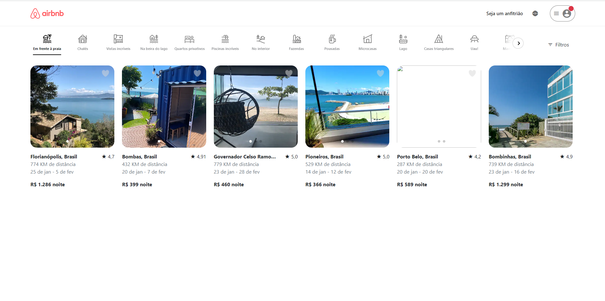

  

 

  

 

# 🛫Aplicação de Criação do Site da Empresa "airbnb"
ABem-vindo à nossa aplicação de criação do site da empresa "O Airbnb". Esta aplicação é uma réplica da famosa plataforma que conecta viajantes em busca de acomodações a pessoas interessadas em alugar seus quartos ou imóveis disponíveis para obter uma renda extra. 

 
<h3 align="center">Desenvolvido em: </h3>

    
    
    
    

 

### 📘 Ferramentas/Bibliotecas utilizadas
  - Biblioteca para criação de interfaces: `reactJS`
  - Setup para criar o projeto no React: `ViteJS`
  - Estilo: `Tailwind`
  - Biblioteca de ícones: `react-icons`
  - Lib de navegação do projeto: `react-router-dom`

  ## ✔️ Autora

- [LucieneFreitas](https://github.com/LucieneFreitas)

## 📄 Referência

- [Programação Web](https://curso.programacaoweb.com.br/)